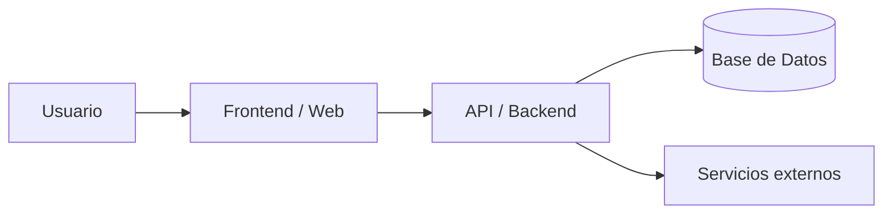

# Nombre del Proyecto

## Resumen ejecutivo

### Descripción
Este repositorio contiene la solución para **[nombre del sistema o producto]**.
Su propósito es permitir a **[tipo de usuario]** realizar **[proceso principal]** de forma eficiente, segura y escalable.

### Problema identificado
Actualmente, **[describir el problema actual]** provoca:
- Retrasos en procesos operativos
- Errores manuales
- Falta de trazabilidad
- Baja escalabilidad

### Solución
La solución propuesta consiste en una plataforma **[web / móvil / API / monolito / microservicios]** que permite:
- Automatizar procesos
- Centralizar información
- Mejorar la experiencia del usuario
- Facilitar despliegues y mantenimiento

### Arquitectura
La solución está compuesta por:
- **Frontend:** [React, Angular, HTML, etc.]
- **Backend / API:** [Java, Spring Boot, Node.js, etc.]
- **Base de datos:** [MySQL, PostgreSQL, MongoDB, etc.]
- **Infraestructura:** [Docker, Nginx, Heroku, AWS, etc.]



## Tabla de contenidos
- [Resumen ejecutivo](#resumen-ejecutivo)
- [Requerimientos](#requerimientos)
- [Instalación](#instalación)
- [Configuración](#configuración)
- [Uso](#uso)
- [Contribución](#contribución)
- [Roadmap](#roadmap)
- [Wiki del proyecto](../../wiki)
- [Documentación externa](https://tudominio.readthedocs.io/)

## Requerimientos

### Infraestructura
- Servidor de aplicación: **[Tomcat / Spring Boot / Node / otro]**
- Servidor web: **[Nginx / Apache / no aplica]**
- Base de datos: **[MySQL / PostgreSQL / MongoDB / otra]**
- Sistema operativo recomendado: **[Ubuntu / Windows / macOS]**

### Software y dependencias
- **Java:** [17 / 21 / otra]
- **Maven o Gradle:** [versión]
- **Node.js:** [versión, si aplica]
- **Docker:** [versión, si aplica]
- **Git:** [versión mínima]

### Paquetes adicionales
- **[Librería 1]**
- **[Librería 2]**
- **[Framework 1]**
- **[Driver de BD]**

## Instalación

### Clonar repositorio
```bash
git clone https://github.com/usuario/repositorio.git
cd repositorio
```

### Variables de entorno
```env
APP_PORT=8080
DB_HOST=localhost
DB_PORT=5432
DB_NAME=nombre_bd
DB_USER=usuario
DB_PASSWORD=password
JWT_SECRET=secret_key
```

### Instalar dependencias
#### Backend
```bash
./mvnw clean install
```

#### Frontend
```bash
npm install
```

### Ejecutar ambiente de desarrollo
#### Backend
```bash
./mvnw spring-boot:run
```

#### Frontend
```bash
npm run dev
```

## Pruebas manuales

### Pruebas funcionales manuales
1. Iniciar la aplicación.
2. Acceder a `http://localhost:8080` o `http://localhost:3000`.
3. Iniciar sesión con un usuario de prueba.
4. Validar:
   - Creación de registros
   - Edición de registros
   - Eliminación de registros
   - Consulta de reportes
   - Acceso por roles

### Pruebas automatizadas
```bash
./mvnw test
```

## Despliegue

### Producción en ambiente local
```bash
./mvnw clean package
java -jar target/app.jar
```

### Docker
```bash
docker build -t nombre-app .
docker run -p 8080:8080 --env-file .env nombre-app
```

### Heroku
```bash
heroku create nombre-app
heroku config:set DB_HOST=...
heroku config:set DB_USER=...
heroku config:set DB_PASSWORD=...
git push heroku main
```

## Configuración

### Archivos principales
- `src/main/resources/application.properties`
- `src/main/resources/application.yml`
- `.env`
- `docker-compose.yml`

### Ejemplo
```properties
server.port=8080
spring.datasource.url=jdbc:postgresql://localhost:5432/nombre_bd
spring.datasource.username=usuario
spring.datasource.password=password
spring.jpa.hibernate.ddl-auto=update
```

### Validaciones previas
- Base de datos creada
- Variables de entorno configuradas
- Puerto disponible
- Dependencias instaladas
- Credenciales válidas

## Uso

### Referencia para usuario final
El usuario final puede:
- Iniciar sesión
- Consultar información
- Crear, editar o eliminar registros
- Descargar reportes

Manual:
- [Manual de usuario final](../../wiki/Manual-de-Usuario)
- [Documentación externa](https://tudominio.readthedocs.io/)

### Referencia para usuario administrador
El administrador puede:
- Gestionar usuarios y roles
- Configurar parámetros globales
- Consultar bitácoras
- Gestionar permisos

Manual:
- [Manual de administrador](../../wiki/Manual-de-Administrador)
- [Documentación externa](https://tudominio.readthedocs.io/)

## Contribución

### 1. Clonar repositorio
```bash
git clone https://github.com/usuario/repositorio.git
cd repositorio
```

### 2. Crear nueva rama
```bash
git checkout -b feature/nombre-cambio
```

### 3. Guardar cambios
```bash
git add .
git commit -m "feat: descripción breve del cambio"
```

### 4. Subir rama
```bash
git push origin feature/nombre-cambio
```

### 5. Enviar Pull Request
- Abrir un Pull Request hacia `main` o `develop`
- Describir claramente el objetivo
- Adjuntar evidencia si aplica

### 6. Esperar revisión y merge
- Atender comentarios
- Realizar ajustes
- Hacer merge al aprobarse

## Roadmap
- [ ] Integración con OAuth2 / SSO
- [ ] Panel de métricas
- [ ] Exportación avanzada de reportes
- [ ] Notificaciones por correo
- [ ] Docker Compose
- [ ] CI/CD
- [ ] Cobertura de pruebas > 80%
- [ ] Soporte multirol
