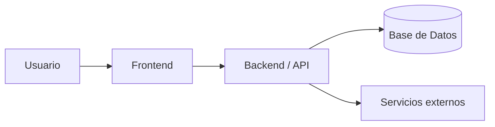

# Arquitectura

## Componentes principales
- **Frontend:** [tecnología]
- **Backend:** [tecnología]
- **Base de datos:** [tecnología]
- **Infraestructura:** [Docker, nube, servidor]

## Diagrama

## Consideraciones
- Separación de responsabilidades
- Escalabilidad
- Seguridad
- Mantenibilidad
